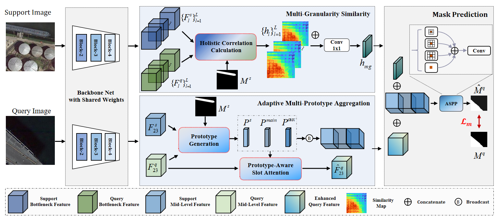

# Multi-Granularity Aggregation Network for Remote Sensing Few-Shot Segmentation [TGRS 2024]
Shi-Feng Peng, Guo-Sen Xie, Fang Zhao, Xiangbo Shu, Qingshan Liu.

Welcome to the official PyTorch implementation repository of our paper [Multi-Granularity Aggregation Network for Remote Sensing Few-Shot Segmentation](https://ieeexplore.ieee.org/abstract/document/10758690), accepted to TGRS 2024.


## Framework




## Requirements

### Environment

```
git clone https://github.com/CVL-hub/MGANet
cd MGANet

conda create -n MGANet python=3.9
conda activate MGANet

pip install -r requirements.txt
```

### Dataset and Weights

Download the datasets from [here](https://pan.baidu.com/s/1NjZxFxLCNcaTCu_uQO8NNA?pwd=2f3y) and the put them in the data directory.

```
MGANet
└─data
    └─iSAID
        └─train
        └─val
    └─LoveDA
    	└─train
    	└─val
```


Download the ImageNet pretrained backbone from [here](https://pan.baidu.com/s/1l9CPkmP69sbxzUYUtwVISg?pwd=n314) and put them in the pretrained_model directory.

```
MGANet
└─pretrained_model
	└─resnet50_v2.pth
	└─....
```

We also provide the trained models weights for evaluation. [vgg16](https://drive.google.com/file/d/1SH3jOrV1zNyNJNyiEfPdNz7x7_7MWKjp/view?usp=drive_link),  [resnet50](https://drive.google.com/drive/folders/10W9SjQFjWVVF8JFTOypUaLSPMaNCirEl?usp=drive_link),  [resnet101](https://drive.google.com/drive/folders/1QNhpuzppl699Y3GE4nQLXpTN03hDPy-7?usp=drive_link), [Non-BAM](https://drive.google.com/drive/folders/1FgezcFfhQpaC5rvSg218CPKE0vjwkb8I?usp=drive_link).

You need to pre-configure the script file with settings such as GPU, backbone network, and other parameters., and run the following code for training and testing:

```
bash train.sh
bash test.sh
```


## Non-BAM settings

 To switch to the non-BAM setting, simply copy the contents of `dataset-BAM.py` and replace the existing `dataset.py`

```
MGANet
└─utils
 └─dataset.py
 └─dataset-BAM.py

```


## Related Repositories

This repository is built upon the foundations of [MSANet](https://github.com/AIVResearch/MSANet), [Slot Attention](https://github.com/google-research/google-research/tree/master/slot_attention), and [DMNet](https://github.com/HanboBizl/DMNet?tab=readme-ov-file). We are very grateful for their work!


## Citation

If you find this project useful, please consider giving a star ⭐ and citation 📚:

```
@ARTICLE{10758690,
  author={Peng, Shi-Feng and Xie, Guo-Sen and Zhao, Fang and Shu, Xiangbo and Liu, Qingshan},
  journal={IEEE Transactions on Geoscience and Remote Sensing}, 
  title={Multi-Granularity Aggregation Network for Remote Sensing Few-Shot Segmentation}, 
  year={2024},
  volume={},
  number={},
  pages={1-1},
  keywords={Remote sensing;Prototypes;Semantic segmentation;Airplanes;Semantics;Training;Feature extraction;Correlation;Sensors;Few shot learning;Few-shot segmentation;multi-granularity;remote sensing;slot attention;background context;intra-class inconsistency},
  doi={10.1109/TGRS.2024.3503273}}

```
